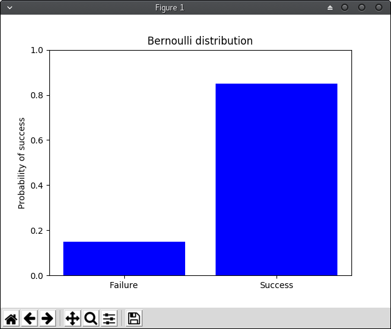
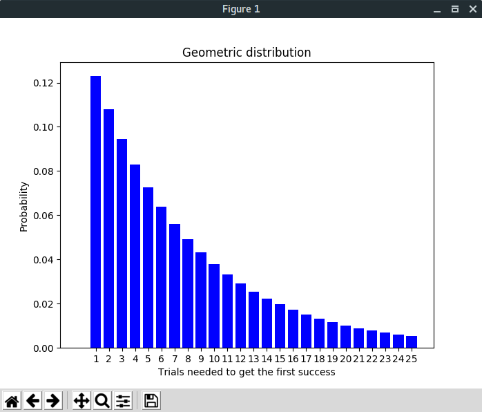
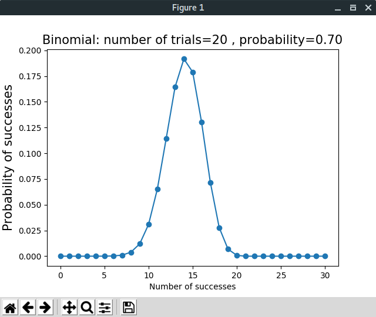
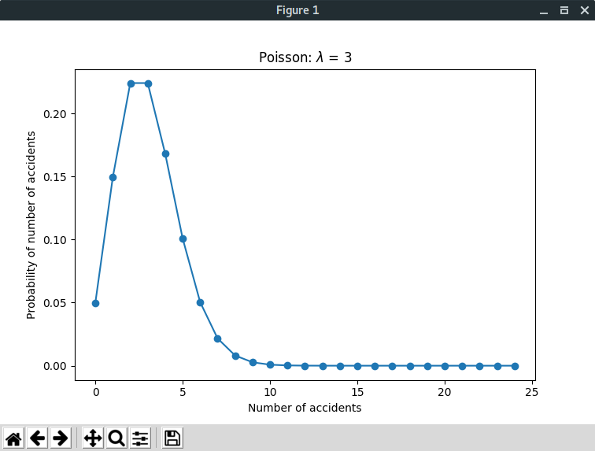

# distributions

[](https://travis-ci.org/hoenirvili/distributions)

Simple package for computing different distributions

```
Usage: distributions [OPTIONS] COMMAND [ARGS]...

Options:
  --plot  Plot all the pmfs of the distribution
  --help  Show this message and exit.

Commands:
  bernoulli  Bernoulli distribution
  binomial   Binomial distribution
  geometric  Geometric distribution
  poisson    Poisson distribution

```

## Installation

```bash
make
```

## Remove
```bash
make uninstall
```

## Run

```
$ distributions bernoulli 0.85

[[Distibutions]]
Mean: 0.85
Variance: 0.1275
Standard deviation: 0.3570714214271425
Cumulative density function: 1.0
Probability mass function: 0.0
PMFS: [ 0.15  0.85]
```

## Plot the results


```bash
$ distribution --plot bernoulli 0.85
```





```bash
$ distributions --plot geometric 25 0.123
```





```
$ distributions --plot binomial 30 20 0.7 
```





```
$ distributions --plot poisson 25 3
```




